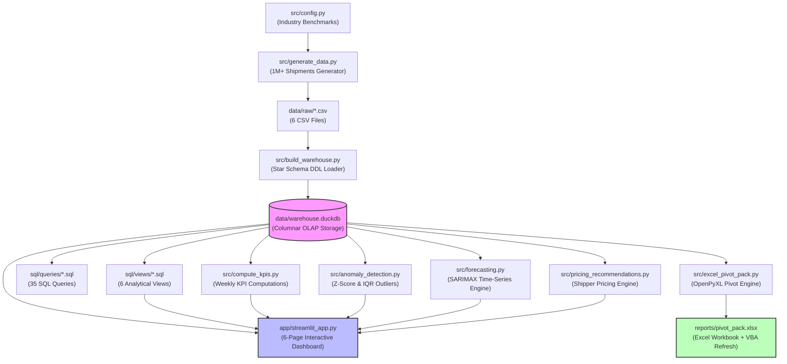
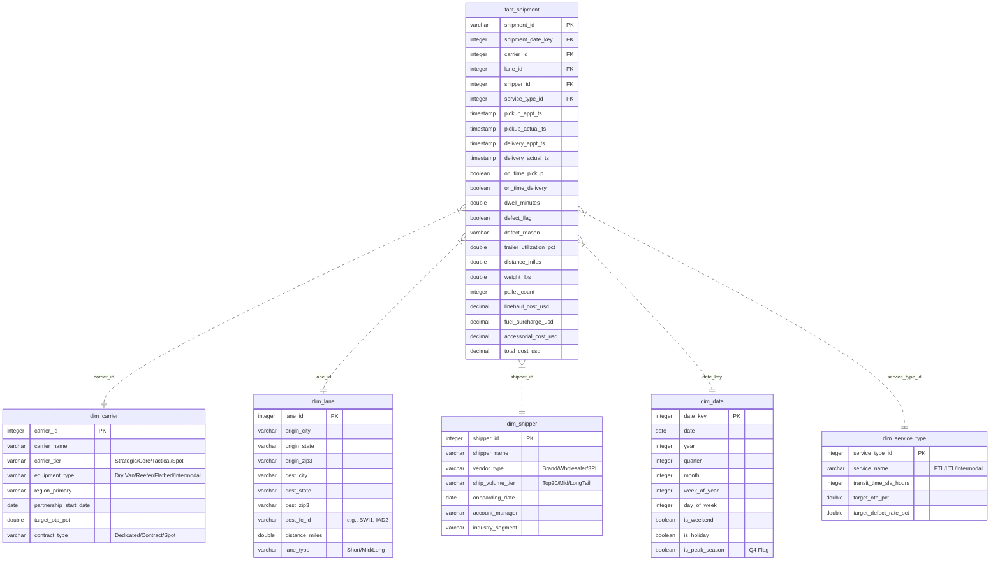

# 🚚 Inbound First-Mile Carrier Performance Dashboard & Analytics Stack

[](https://www.python.org/)
[](https://duckdb.org/)
[](https://streamlit.io/)
[](https://plotly.com/)
[](https://docs.pytest.org/)
[](https://github.com/astral-sh/ruff)
[](LICENSE)

An end-to-end, production-grade analytics pipeline and decision-support dashboard simulating Amazon Inbound Transportation (AIT) operations. Featuring a **1.02M+ shipment synthetic data warehouse** calibrated to industry benchmarks, **35 advanced analytical SQL queries** (including in-database statistical hypothesis testing), statistical anomaly detection, SARIMAX forecasting, automated Excel reporting, and a 6-page interactive Streamlit application.

---

## 🏗️ Architecture & Data Flow

### 🔄 End-to-End Pipeline Workflow


### ⭐ Database Schema Design (Star Schema)
The warehouse implements a star schema model centered at shipment grain, ensuring optimal performance for columnar aggregation queries.


---

## ✨ Core Features & Capabilities

*   **1M+ Shipment Synthesized Warehouse:** A python generator generates realistic transactions mapping weekend facility backlogs, seasonal price hikes, modal mixes, carrier performance patterns, and a deliberately injected 14-day tracking system failure to test anomaly detection.
*   **OLAP Warehouse (DuckDB):** An embedded database capable of execution speeds comparable to dedicated servers, implementing strict primary/foreign key validations and Decimal-type currency mapping for zero rounding error.
*   **35 Numbered Business SQL Queries:** SQL scripts covering cost-to-serve analysis, modal mismatch identification, late pickup cascades, Pareto defect distributions, and **in-database statistical hypothesis testing** (paired t-test, chi-square test of independence, Mann-Whitney U test).
*   **Dual-Method Anomaly Detection:** 
    *   *Z-Score (OTP):* Rolling 8-week standard deviations monitoring performance drops.
    *   *IQR (Cost):* Interquartile range filters targeting right-tailed cost anomalies.
*   **SARIMAX Forecasting:** Statistical predictions modeling 4-week OTP and 28-day cost curves complete with 95% confidence intervals.
*   **Automated Excel Pivot Pack:** Python-generated Excel package featuring formatting, heatmaps, auto-filters, cover cards, and a VBA refresh macro.
*   **Interactive Streamlit Dashboard:** Multi-page web app presenting:
    *   *Executive Summary:* Core performance KPIs and MoM velocity metric cards.
    *   *Shipper Health Scorecard:* Weighted composite scoring (Service 30%, Cost 25%, Growth 20%, Reliability 15%, Tenure 10%) focusing on shipper retention.
    *   *Lane & Carrier Scorecards:* Drill-down grids displaying performance and defect Pareto breakdown.
    *   *What-If Lane Simulator:* Bootstrap simulations (1,000 iterations) projecting OTP & cost shift impacts.

---

## 📈 Core Findings & Business Insights

Selected findings from [INSIGHTS.md](INSIGHTS.md), mapping operations data to actionable interventions:

| Insight | Core Finding | Supporting SQL | Actionable Recommendation |
|:---|:---|:---|:---|
| **#1. Monday Congestion** | Monday OTP averages **82-83%** (vs. 88-89% mid-week) due to weekend backlog, NOT volume. | `q06_otp_by_dayofweek.sql` | Stagger 30% of Monday pickup appointments into early morning (0600-0800) or shift to Tuesday. |
| **#2. Spot Carrier Defects** | Spot-tier carriers on long-haul lanes (>1,500 miles) show a defect rate of **>5%** (1.8x average). | `q32_chi_square_defect...sql` | Restrict Spot carriers on lanes >1,500 miles; reallocate to contracted Strategic/Core capacity. |
| **#3. Modal Mismatches** | **15% of LTL shipments** utilize >70% trailer capacity and weigh >30k lbs, overpaying LTL premiums. | `q21_modal_mismatch...sql` | Convert identified lanes to Full Truckload (FTL) contract capacity, yielding 15-20% rate reductions. |
| **#4. Accessorial Drags** | Accessorials represent **15% of total spend**, heavily driven by facility dwell delays. | `q12_accessorial_as_pct...sql` | Implement a 2-hour detention clock with automated carrier escalations at 90 minutes. |
| **#7. Strategic Tier Value** | Strategic carriers statistically outperform Tactical by **5-8pp in OTP** (p < 0.05). | `q31_hypothesis_strategic...sql` | Shift 10% volume on weak lanes to Strategic partners using What-If simulator predictions. |

---

## 📂 Repository File Tree

```
first-mile-carrier-dashboard/
├── .gitignore
├── .python-version
├── LICENSE
├── Makefile                     # Build & run automation script
├── README.md                    # Project documentation
├── INSIGHTS.md                  # Detailed Working Backwards business briefs
├── pyproject.toml               # Linter configuration (Ruff)
├── requirements.txt             # Project python requirements
├── runtime.txt                  # Deployment python version
│
├── app/
│   └── streamlit_app.py         # Multi-page interactive application
│
├── docs/                        # Specifications and methodology
│   ├── architecture.md
│   ├── data_dictionary.md       # Star Schema definitions
│   ├── interview_prep.md        # Q&A guidelines
│   ├── kpi_definitions.md       # Exact KPI calculations (OTP-P, OTD, etc.)
│   ├── laymans_guide.md
│   ├── methodology.md
│   └── project_deep_dive.md
│
├── sql/
│   ├── ddl/                     # Schema definitions (Tables 01-06)
│   ├── views/                   # Materialized view definitions (Scorecards)
│   └── queries/                 # 35 execution-ready queries (q01-q35)
│
├── src/                         # Analytical core logic
│   ├── __init__.py
│   ├── anomaly_detection.py     # Z-Score & IQR implementation
│   ├── build_warehouse.py       # DuckDB Star Schema loader
│   ├── compute_kpis.py          # View exporter utility
│   ├── config.py                # Reference-calibrated generator thresholds
│   ├── excel_pivot_pack.py      # Programmatic Excel OpenPyXL script
│   ├── forecasting.py           # SARIMAX statistical forecast script
│   ├── generate_data.py         # 1M+ transaction generator engine
│   ├── pricing_recommendations.py# Account-manager pricing logic
│   └── quality_checks.py        # 9 data-assertion unit tests
│
├── tests/                       # Automated tests (30/30 Passing)
│   ├── test_anomaly_detection.py
│   ├── test_data_generation.py
│   ├── test_excel_output.py
│   ├── test_forecasting.py
│   └── test_warehouse_integrity.py
│
├── reports/                     # Output assets (gitignored/auto-generated)
├── tableau/                     # Tableau Public integration metadata
└── vba/
    └── auto_refresh.bas         # Excel Pivot table refresh VBA macro
```

---

## 🛠️ Installation & Setup

### Prerequisites
*   **Python 3.11**
*   **make** (optional, for automation commands)

### 1. Set Up Environment
We recommend using a Python virtual environment to manage dependencies:

```bash
# Clone the repository
git clone https://github.com/rahul0443/first-mile-carrier-dashboard.git
cd first-mile-carrier-dashboard

# Create and activate virtual environment
python3 -m venv .venv
source .venv/bin/activate

# Install dependencies
pip install --upgrade pip
pip install -r requirements.txt
```

### 2. Build & Generate the Warehouse
Run the analytical pipeline. The script will generate the data, build the star schema warehouse inside DuckDB, execute all analytical models, and create output sheets:

Using **Makefile** (recommended):
```bash
make all
```

Using **Python** commands directly:
```bash
python -m src.generate_data
python -m src.build_warehouse
python -m src.compute_kpis
python -m src.anomaly_detection
python -m src.forecasting
python -m src.pricing_recommendations
python -m src.excel_pivot_pack
```

### 3. Launch Dashboard & Test Suite
To start the multi-page Streamlit dashboard locally:
```bash
make app
# Or: streamlit run app/streamlit_app.py
```
*The dashboard will be served at `http://localhost:8501`.*

To run the automated test suite verifying database constraint and model integrity:
```bash
make test
# Or: pytest -v
```

---

## ⚙️ Tech Stack Details

*   **Language:** Python 3.11 (configured via `.python-version` and `runtime.txt`)
*   **Database Engine:** DuckDB OLAP (Serverless, vectorized execution)
*   **Statistical Libraries:** statsmodels (SARIMAX models), scipy (statistical tests), scikit-learn
*   **Data Processing:** pandas (dataframes), numpy (linear algebra & bootstrap simulation)
*   **Reporting & Excel:** openpyxl (formatted sheets), VBA (macro-refresh tables)
*   **Dashboard Framework:** Streamlit (UI/UX layout), Plotly (interactive charts)
*   **Code Quality:** Ruff (linting), pytest (30 unit tests validating pipeline components)

---

## 📄 License

This project is licensed under the MIT License - see the [LICENSE](LICENSE) file for details.
